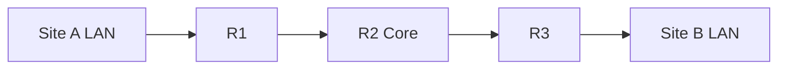

# Secure Multi-Site Network Lab

## Purpose

This simulated lab demonstrates how I plan, configure, secure, and validate a small routed network. It is designed to show practical troubleshooting and documentation habits for junior network and IT support roles.

## Lab scope

- Three-router topology with separate site networks
- OSPF for dynamic route exchange
- SSH for encrypted remote administration
- Local AAA and role-based command access
- Access control lists for traffic restrictions
- Site-to-site IPsec VPN concepts and verification
- Packet capture and traffic analysis with Wireshark
- Topology and IP-addressing documentation

## Configuration approach

1. Planned addressing and interface assignments before configuration.
2. Configured router interfaces and confirmed local connectivity.
3. Enabled OSPF and checked neighbor relationships and learned routes.
4. Restricted device administration to SSH and configured local authentication.
5. Applied access controls, then tested permitted and denied traffic.
6. Validated end-to-end reachability and reviewed packet captures.
7. Recorded results and troubleshooting notes so the lab could be repeated.

## Validation checklist

- Interfaces show the expected status and addressing.
- OSPF neighbors reach the full state.
- Routing tables contain the remote site networks.
- SSH succeeds with the intended account and access level.
- ACL tests match the documented permit and deny rules.
- VPN test traffic is generated and security associations are checked.
- Packet captures show the expected protocol and traffic flow.

## Troubleshooting method

I work from the lowest useful layer upward: interface state, addressing, local reachability, routing, policy, then encryption. Each change is tested before moving to the next layer so configuration errors are easier to isolate.

## Evidence status

This case study records the design and validation process. Packet Tracer files, sanitized configurations, command output, and screenshots should be added only after they are captured from the working lab.

> Scope note: This is an educational lab environment, not a production network.
